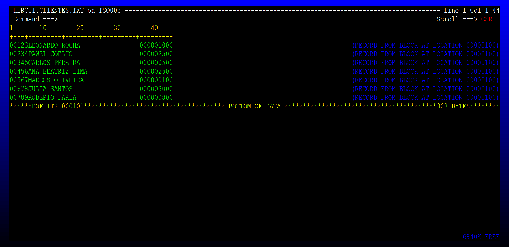
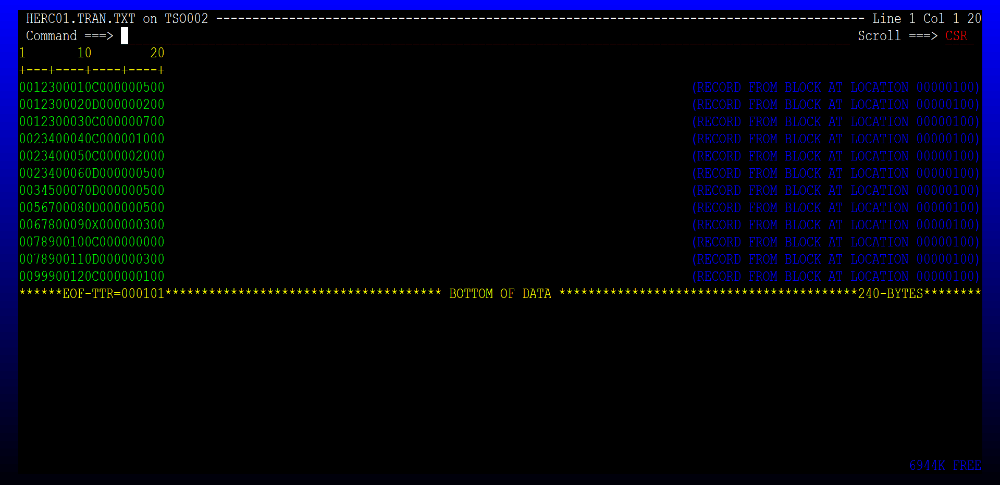
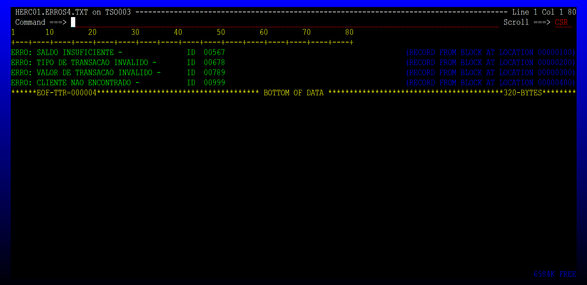
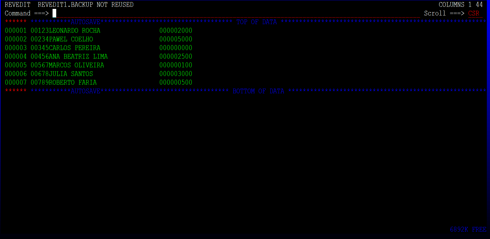
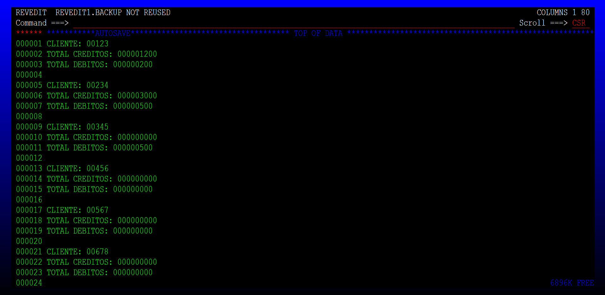
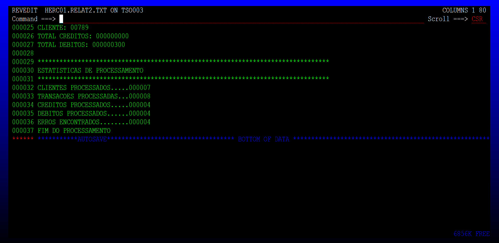
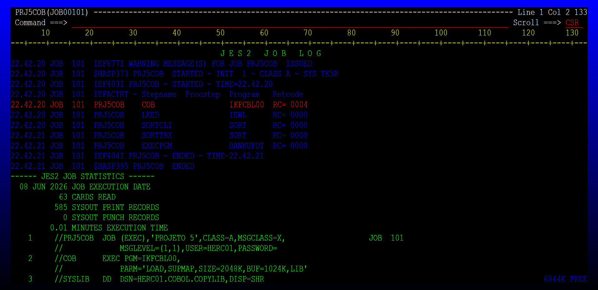

# Projeto 5 COBOL – Semana 7
## Processamento de Transações Bancárias

---

## Descrição

Sistema desenvolvido em COBOL e JCL para processamento diário de transações bancárias. O job realiza a ordenação dos arquivos de entrada, executa o programa COBOL de match/merge entre clientes e transações, atualiza os saldos, gera relatórios e registra erros de inconsistência.

---

## Estrutura do Projeto

```
projeto5/
├── assets/          # Prints de evidência da execução no TSO
├── input/           # Arquivos de entrada (CLIENTES.TXT, TRANSACAO.TXT)
├── jcl/             # PRJ5COB.JCL
├── output/          # Arquivos de saída gerados (CLIENTES_ATUALIZ.TXT, ERROS.TXT, RELAT.TXT)
└── src/             # Fonte COBOL (PROJ5.CBL)
```

---

## Arquivos de Entrada

### CLIENTES.TXT
Contém os dados dos clientes com ID, nome e saldo inicial.

**Layout:**
```
01 REG-CLIENTE.
   05 CLI-ID    PIC 9(05).
   05 CLI-NOME  PIC X(30).
   05 CLI-SALDO PIC 9(09).
```



---

### TRANSACOES.TXT
Contém as transações de débito (D) e crédito (C) referenciadas por ID de cliente.

**Layout:**
```
01 REG-TRANSACAO.
   05 CLI-ID    PIC 9(05).
   05 TRX-ID    PIC 9(05).
   05 TRX-TIPO  PIC X(01).   *> C = Crédito / D = Débito
   05 TRX-VALOR PIC 9(09).
```



---

## Lógica de Processamento (Match/Merge)

O programa realiza a leitura simultânea dos dois arquivos (já ordenados por ID) e compara os registros:

| Situação | Ação |
|---|---|
| ID cliente = ID transação | Processa a transação |
| ID cliente < ID transação | Grava cliente sem transação |
| ID transação < ID cliente | Registra erro e ignora |

---

## Tratamento de Erros

O programa valida as transações e registra inconsistências em `ERROS.TXT`:

| # | Situação | Mensagem de Erro |
|---|---|---|
| 1 | Cliente não encontrado | `ERRO: CLIENTE NAO ENCONTRADO - ID XXXXX` |
| 2 | Tipo de transação inválido (≠ C ou D) | `ERRO: TIPO DE TRANSACAO INVALIDO - ID XXXXX` |
| 3 | Valor da transação zerado | `ERRO: VALOR DE TRANSACAO INVALIDO - ID XXXXX` |
| 4 | Saldo insuficiente para débito | `ERRO: SALDO INSUFICIENTE - ID XXXXX` |



---

## Arquivos de Saída

### CLIENTES_ATUALIZ.TXT
Arquivo com o mesmo layout do arquivo de clientes, porém com os saldos atualizados após o processamento das transações.



---

### RELAT.TXT — Relatório de Processamento
Exibe os totais de créditos e débitos por cliente, seguido das estatísticas gerais de execução.





---

## Execução do JOB no TSO

O JCL `PRJ5COB.JCL` executa os seguintes steps:

| Step | Programa | Função | RC |
|---|---|---|---|
| COB | IKFCBL00 | Compilação do fonte COBOL | 0004 |
| LKED | IEWL | Link-edição | 0000 |
| SORTCLI | SORT | Ordenação do arquivo de clientes | 0000 |
| SORTTRX | SORT | Ordenação do arquivo de transações | 0000 |
| EXECPGM | BANKUPDT | Execução do programa principal | 0000 |




---

## Estatísticas de Execução (resultado obtido)

```
****************************************
ESTATISTICAS DE PROCESSAMENTO
****************************************
CLIENTES PROCESSADOS.....: 000007
TRANSACOES PROCESSADAS...: 000008
CREDITOS PROCESSADOS.....: 000004
DEBITOS PROCESSADOS......: 000004
ERROS ENCONTRADOS........: 000004
FIM DO PROCESSAMENTO
```
